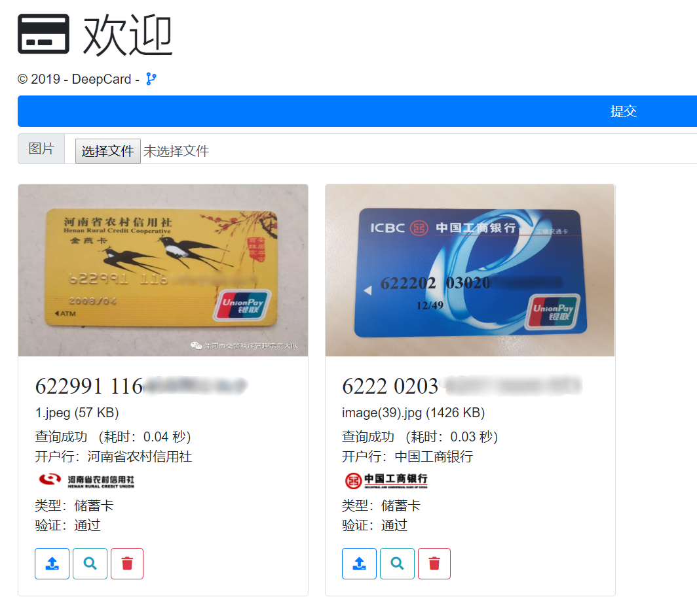

# DeepCard

    

A bank card number recognition system based on deep-learning.

# Usage

1. Install Docker and Docker-Compose.
2. Clone this repository and enter the deploy directory `docker/deploy`. 
3. Use `docker-compose up -d` to start.
4. Visit `http://localhost:8550` to use it.
   - A demo app is running on `http://localhost:8500`

## Dependences

1. Python
2. OpenCV
3. Pytorch
4. .NET Core 3.0
5. Alipay bank card API
   - Only for querying bank card information

# Collaborators

- [@courao](https://github.com/courao)
- [@mitdalao](https://github.com/mitdalao)
- [@GreatTMZ](https://github.com/GreatTMZ)